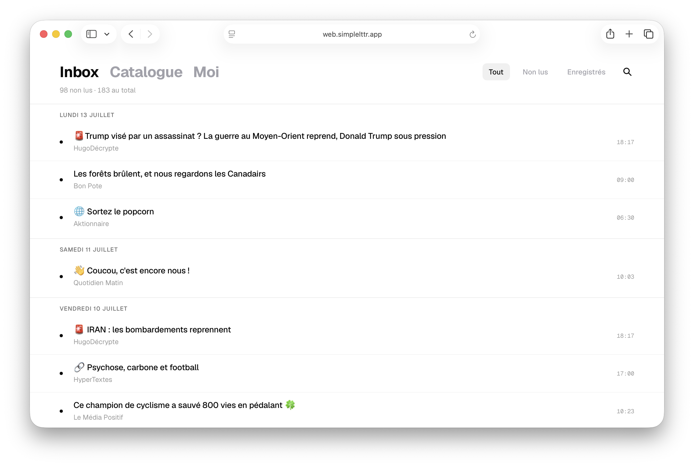

# SimpleLttr

Vos newsletters, sans le bruit.

## Concept

[SimpleLttr](https://simplelttr.app) est un lecteur de newsletters minimaliste. Une seule adresse pour tout recevoir, un seul endroit pour tout lire.
Fini les newsletters qui s'accumulent, non lues, entre deux mails de spam. SimpleLttr vous donne une adresse de transfert dédiée : abonnez-vous avec elle, et chaque numéro arrive directement dans votre inbox — rangé, classé, prêt à lire.

SimpleLttr est fait pour les gens qui aiment lire — pas pour ceux qui aiment scroller.



## Pourquoi ce projet ?

> Je me suis lancé dans ce projet avec pour objectif de *vibe coder* une application web et mobile de A à Z. L'idée était d'aller jusqu'à la mise en production, pour la rendre réellement accessible à tous. J'ai ainsi traversé toutes les étapes du cycle de vie d'un produit, de la découverte du concept au déploiement sur les stores, en passant par le design et la mise en place de l'infrastructure.

## Utiliser SimpleLttr

SimpleLttr est disponible en version web sur [web.simplelttr.app](https://web.simplelttr.app) et dispose d'une application [iOS](https://apps.apple.com/us/app/simplelttr/id6791232107) et [Android](https://play.google.com/store/apps/details?id=app.simplelttr).

## Stack technique

L'application est divisée en trois grandes parties :

* Backend : développé en **Java SpringBoot** (dockerisé pour la production).
* Frontend (web) : développé en **TypeScript** (dockerisé pour la production).
* Applications mobile natives : développées avec Expo (déployées sur les stores).

En amont du backend, l'application utilise le serveur [CloudFlare Email Routing](https://developers.cloudflare.com/email-service/) pour prendre en charge le flux entrant de mails envoyés aux différentes adresses uniques des utilisateurs. Cela permet de mieux gérer la charge et d'assurer la bonne récépetion des mails.

## Site vitrine (ce dépôt)

Ce dépôt contient le code du site de présentation de **SimpleLttr** ([simplelttr.app](https://simplelttr.app)).
Construit avec **Next.js (App Router)**, **TypeScript** et **Tailwind CSS v4**.

### Démarrer en local

```bash
npm install
npm run dev
```

Le site est servi sur http://localhost:3000.

### Build de production

```bash
npm run build
npm run start
```